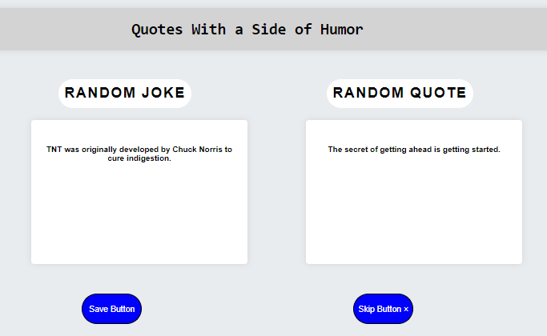

# project-repo

## Description

Quotes with a side of humor is a web page that displays a random quote and random joke to combat the stresses of everyday life with some humor and motivation.

## Installation

N/A

## Usage

You are presented with a random joke and motivational quote. If you like the quotes you can click the "Save" button and you will be presented with the option to copy both of them for you to be able to save; If you don't like them just click the "Skip" button.

## Credits

Collaboration between Jeremy Hoang, Michael Fazio, and Luis Lopez.

## License

Licensed under the MIT license.

## link

The following image shows the web application's appearance:

## Screenshot

The following link displays the application on the web.

